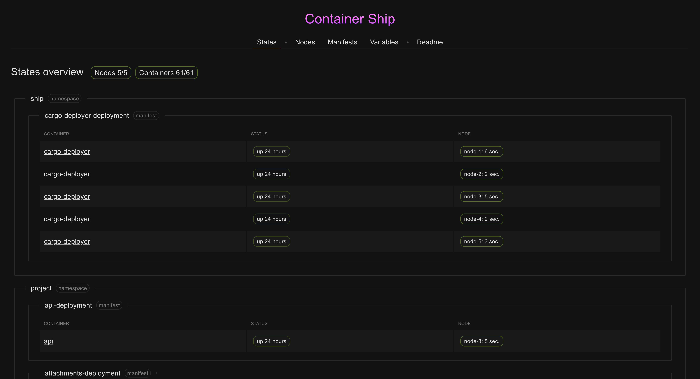

# Container Ship
[](https://goreportcard.com/report/github.com/oxmix/container-ship)
[](https://github.com/oxmix/container-ship/actions/workflows/releases.yaml)
[](https://hub.docker.com/r/oxmix/container-ship)
[](https://hub.docker.com/r/oxmix/cargo-deployer)

Deployment of containers type master-workers fits for multiple regions, minimum settings, access controls and opening ports.

> ### Introduce a New Container Ship `v2`
> 
> * New interface `NMV` – Nodes Manifests Variables
> * Full controls panel in web
> * Now `cargo-deployer` on golang with support multiple workers
> * Support simple canary deployment



## Try fast start

1. `git clone https://github.com/oxmix/container-ship.git`
2. `cd container-ship/example && ./start`
3. open [`http://localhost:8080`](http://localhost:8080)

## Mini Wiki

### Apply deployment manifest
`$parentHostname` is variable hostname parent/internal node, option if needs
```yaml
curl -kX POST https://ship.domain.tld/deployment --data-binary @- << 'EOF'
space: my-project
name: test-deployment
containers:
  - name: test-nginx
    from: nginx
    hostname: $parentHostname
    stop-timeout: 30
    ports:
      - 8080:80
EOF
```

### Magic environment
* update node
* auto replace in each manifest deployment if set equal node and variables {}
```yaml
curl -kX POST https://ship.domain.tld/deployment --data-binary @- << 'EOF'
space: example
name: magick-envs-deployment
containers:
  - name: nginx
    from: nginx
    ports:
      - 8081:80
    environment:
      - PASS={{SECRET_PASS}}
EOF
```


### Manual raise master daemon `container-ship`
```shell
mkdir $(pwd)/assets && \
docker run -d --name container-ship \
  -v $(pwd)/assets:/assets \
  -p 127.0.0.1:8080:8080 \
  -e ENDPOINT=http://localhost:8080 \
  -e CARGO_NAME=cargo-deployer \
  -e CARGO_FROM=oxmix/cargo-deployer:latest \
  --restart always \
  --log-driver json-file \
  --log-opt max-size=64k \
oxmix/container-ship
```

### Logs alert to telegram
* golang by matching: `fatal error:`|`panic:`
* php by matching: `PHP Parse error`|`PHP Fatal error`|`PHP Warning`|`PHP Notice`
* node by matching: `Error:`|`EvalError:`|`RangeError:`|`ReferenceError:`|`SyntaxError:`|`TypeError:`|`URIError:`
```shell
docker run ... \
  ...
  -e NOTIFY_MATCH='fatal error:|panic:|my custom warning' \
  -e NOTIFY_TG_TOKEN=... \
  -e NOTIFY_TG_CHAT_ID=... \
  ...
oxmix/container-ship
```

### Deployment through file
```shell
curl -kX POST https://ship.domain.tld/deployment --data-binary "@test-deployment.yaml"
```

### Example `Logs`
* Showing logs realtime from container with support json pretty

