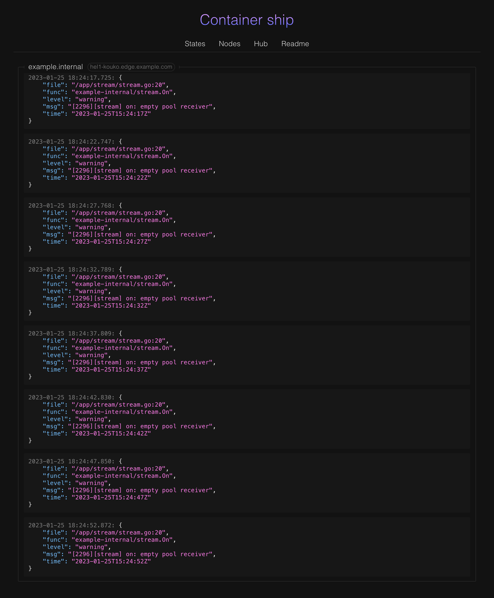

# Container Ship
[](https://goreportcard.com/report/github.com/oxmix/container-ship)
[](https://github.com/oxmix/container-ship/actions/workflows/hub-docker.yaml)
[](https://hub.docker.com/r/oxmix/container-ship)
[](https://hub.docker.com/r/oxmix/cargo-deployer)

Deployment of containers type master-workers fits for multiple regions, minimum settings, access controls and opening ports.


## Try fast start

1. `git clone https://github.com/oxmix/container-ship.git`
2. `cd container-ship/example && ./start`
3. open [`http://localhost:3080`](http://localhost:3080)

## Mini Wiki

### Connect machine, will be install `cargo-deployer`
* Execute on the worker node
```shell
curl -sk https://ship.domain.tld/connection | sudo bash -
```

### Apply deployment manifest
`$parentHostname` is variable hostname parent/internal node, option if needs
```yaml
curl -kX POST https://ship.domain.tld/deployment --data-binary @- << 'EOF'
space: my-project
name: test-deployment
containers:
  - name: test-nginx
    from: nginx
    hostname: $parentHostname
    stop-time: 30
    ports:
      - 8080:80
EOF
```

### Add/update node to a ship
```yaml
curl -kX POST https://ship.domain.tld/nodes/apply --data-binary @- << 'EOF'
IPv4: 127.0.0.1
name: localhost
deployments:
  - my-project.test-deployment
EOF
```

### Delete node
* All containers will be destroyed and `cargo-deployer` too
```shell
curl -kX DELETE https://ship.domain.tld/nodes/apply?name=localhost
```

### Delete manifest deployment
* All containers of manifest will be destroyed
```shell
curl -kX DELETE https://ship.domain.tld/deployment?name=my-project.test-deployment
```

### Magic environment
* update node
```yaml
curl -kX POST https://ship.domain.tld/nodes/apply --data-binary @- << 'EOF'
IPv4: 127.0.0.1
name: localhost
deployments: 
  - my-project.test-nginx
variables:
  - key: PASS_SEC
    val: 32167
EOF
```
* auto replace in each manifest deployment if set equal node and variables {}
```yaml
curl -kX POST https://ship.domain.tld/deployment --data-binary @- << 'EOF'
space: example
name: magick-envs-deployment
containers:
  - name: nginx
    from: nginx
    ports:
      - 8081:80
    environment:
      - PASS={PASS_SEC}
EOF
```

### Usage own registry with auto access control by IP nodes
* To raise docker `registry:2`
```shell
docker run -d --name docker-registry \
    --restart always --log-driver json-file --log-opt max-size=128k \
    -p 127.0.0.1:5035:5035 \
    -v `pwd`/data:/var/lib/registry \
  registry:2
```

### Manual raise master daemon `container-ship`
```shell
mkdir $(pwd)/assets && \
docker run -d --name container-ship \
    -v $(pwd)/assets:/assets \
    -p 127.0.0.1:8443:8443 \
    -e ENDPOINT=127.0.0.1:8443 \
    -e CARGO_FROM=mirror.gcr.io/oxmix/cargo-deployer:latest \
    --restart always \
    --log-driver json-file \
    --log-opt max-size=128k \
mirror.gcr.io/oxmix/container-ship
```

### Logs alert to telegram
* golang by matching: `fatal error:`|`panic:`
* php by matching: `PHP Parse error`|`PHP Fatal error`|`PHP Warning`|`PHP Notice`
* node by matching: `Error:`|`EvalError:`|`RangeError:`|`ReferenceError:`|`SyntaxError:`|`TypeError:`|`URIError:`
```shell
docker run ... \
    ...
    -e NOTIFY_MATCH='fatal error:|panic:|my custom warning' \
    -e NOTIFY_TG_TOKEN=... \
    -e NOTIFY_TG_CHAT_ID=... \
    ...
oxmix/container-ship
```

### Deployment through file
```shell
curl -kX POST https://ship.domain.tld/deployment --data-binary "@test-deployment.yaml"
```

### Update node through file
```shell
curl -kX POST https://ship.domain.tld/nodes/apply --data-binary "@localhost.yaml"
```

### Tab `Nodes`
* Shows stats by nodes


### Example `Hub`
* Shows own docker registry


### Example `Logs`
* Showing logs realtime from container with support json pretty

