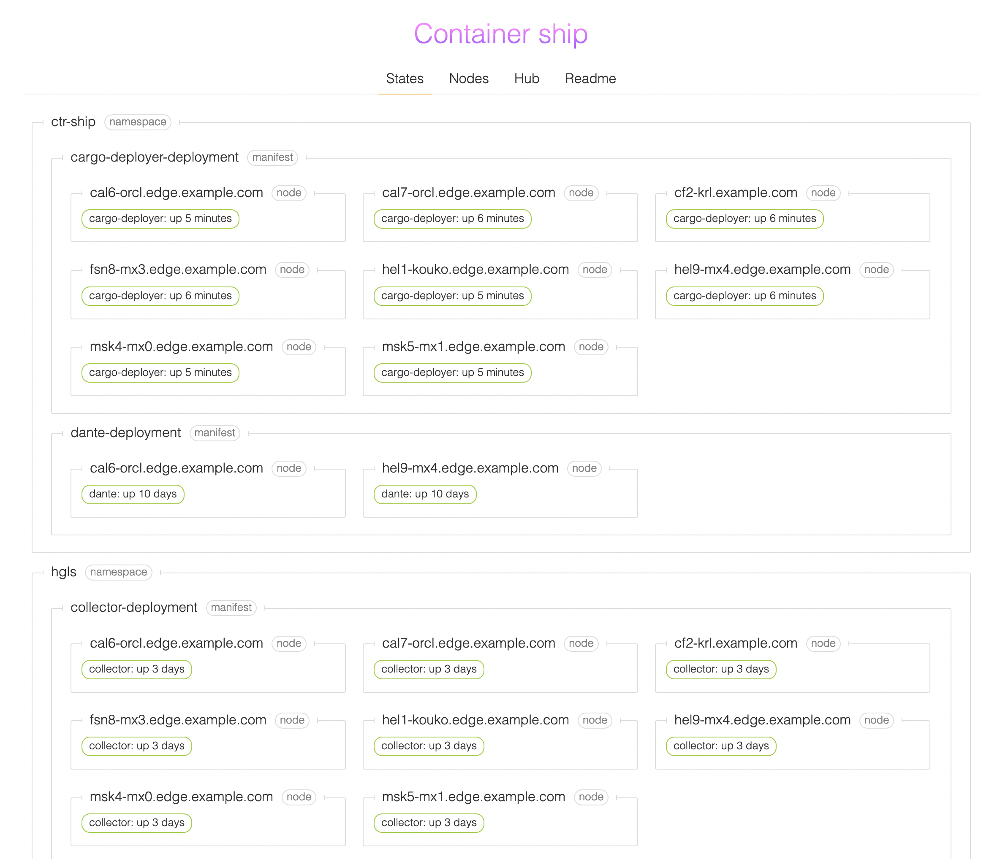
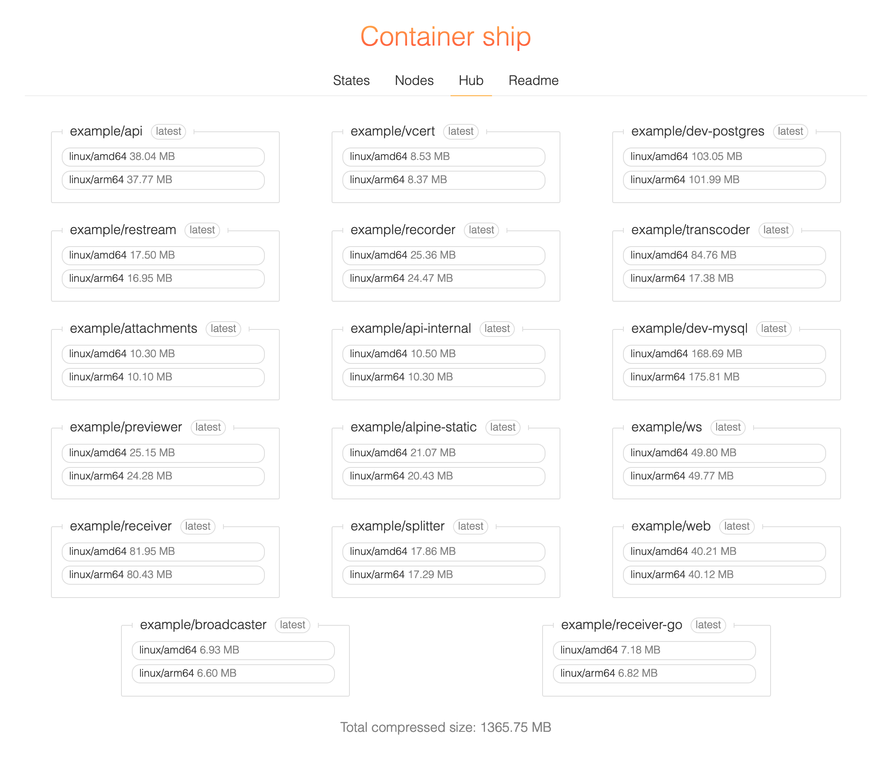
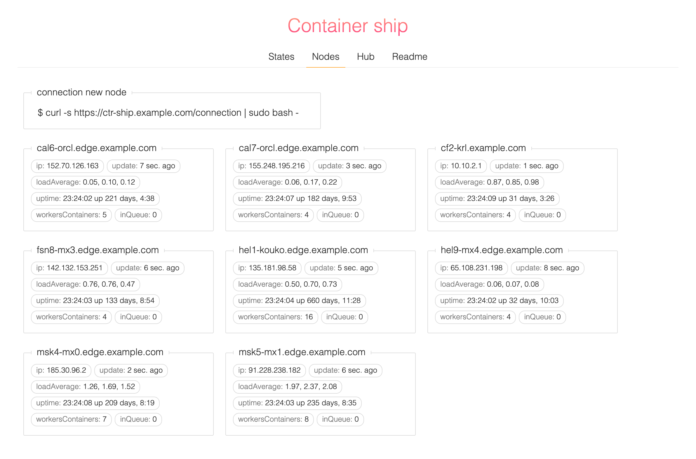

# Container Ship
[](https://goreportcard.com/report/github.com/oxmix/container-ship)
[](https://github.com/oxmix/container-ship/actions/workflows/hub-docker.yaml)
[](https://hub.docker.com/r/oxmix/container-ship)
[](https://hub.docker.com/r/oxmix/cargo-deployer)

Deployment of containers type master-workers fits for multiple regions, minimum settings, access controls and opening ports.



## Try fast start
1. Raise master daemon `container-ship` 
```shell
mkdir $(pwd)/assets && \
docker run -d --name container-ship \
    -v $(pwd)/assets:/assets \
    -p 127.0.0.1:8443:8443 \
    -e ENDPOINT=127.0.0.1:8443 \
    --restart always --log-opt max-size=5m \
oxmix/container-ship
```

2. Connection new node
* Add node to a ship
```yaml
curl -kX POST https://127.0.0.1:8443/nodes/apply --data-binary @- << 'EOF'
IPv4: 127.0.0.1
name: localhost
EOF
```
* Connect machine (execute on the worker node) will be install `cargo-deployer`
```shell
curl -sk https://127.0.0.1:8443/connection | sudo bash -
```

3. Apply deployment manifest
```yaml
curl -kX POST https://127.0.0.1:8443/deployment --data-binary @- << 'EOF'
space: my-project
name: test-deployment
nodes:
  - localhost
containers:
  - name: nginx
    from: nginx
    stop-time: 30
    ports:
      - 8080:80
EOF
```
4. Can see states in the browser [`https://127.0.0.1:8443`](https://127.0.0.1:8443)
 
## Mini Wiki

### Usage own registry with auto access control by IP nodes
* To raise docker `registry:2`
```shell
docker run -d --name docker-registry \
    --restart always --log-opt max-size=5m \
    -p 127.0.0.1:5035:5035 \
    -v `pwd`/data:/var/lib/registry \
  registry:2
```
* Settings nginx vhost
```nginx
server {
    listen 443 ssl http2;
    server_name ctr-ship.example.host;

    access_log off;
    client_max_body_size 0;
    chunked_transfer_encoding on;
    
    location / {
        proxy_pass                 https://127.0.0.1:8443;
        proxy_set_header X-Real-IP $remote_addr;
    }
    
    location = /check {
        internal;
        proxy_pass                      https://127.0.0.1:8443/allowRequest;
        proxy_pass_request_body         off;
        proxy_set_header Content-Length "";
        proxy_set_header X-Original-URI $request_uri;
        proxy_set_header X-Real-IP      $remote_addr;
    }


    location /v2/ {
        if ($http_user_agent ~ "^(docker\/1\.(3|4|5(?!\.[0-9]-dev))|Go ).*$" ) {
            return 404;
        }

        allow 127.0.0.1;
        allow 172.16.0.0/12;
        allow 10.0.0.0/8;
        deny all;
        
        auth_request /check;
    
        proxy_pass                          http://127.0.0.1:5035;
        proxy_set_header  Host              $http_host;
        proxy_set_header  X-Real-IP         $remote_addr;
        proxy_set_header  X-Forwarded-Proto $scheme;
        proxy_read_timeout                  900;
    }
    
    # settings own ssl certs
    ...
}
```
* Tab `Hub` will be activated self



### Delete node
* All containers will be destroyed and `cargo-deployer` too
```shell
curl -kX DELETE https://ctr-ship.example.host/nodes/apply?name=localhost
```

### Delete manifest deployment
* All containers will be destroyed
```shell
curl -kX DELETE https://ctr-ship.example.host/deployment?name=my-project.test-deployment
```

### Magic environments
* update node
```yaml
curl -kX POST https://127.0.0.1:8443/nodes/apply --data-binary @- << 'EOF'
IPv4: 127.0.0.1
name: localhost
variables:
  - key: PASS_SEC
    val: 32167
EOF
```
* auto replace in each manifest deployment if set equal node and variables {}
```yaml
curl -kX POST https://127.0.0.1:8443/deployment --data-binary @- << 'EOF'
space: example
name: magick-envs-deployment
nodes:
  - localhost
containers:
  - name: nginx
    from: nginx
    ports:
      - 8081:80
    environments:
      - PASS={PASS_SEC}
EOF
```
### Deployment through file
```shell
curl -kX POST https://127.0.0.1:8443/deployment --data-binary "@test-deployment.yaml"
```

### Tab `Nodes`
* Shows stats by nodes

